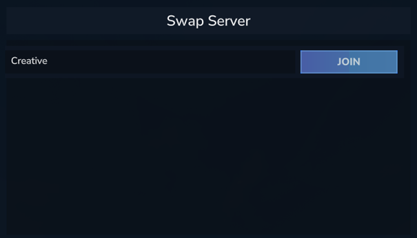
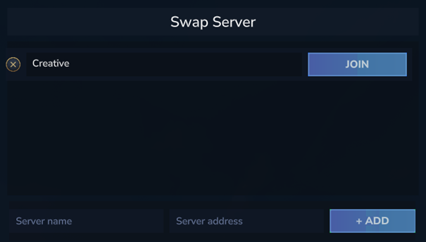

# Swap_Server

## Description
**Swap_Server** is a Hytale server plugin that provides a user-friendly User Interface (UI) for players to easily switch between servers.

Instead of remembering complex commands, players can simply open a menu and click "Join". Administrators have access to an enhanced version of the UI to manage the server list directly from the game.

## Features
- **Visual Interface**: No more chat commands for navigation. Everything is done via a UI.
- **One-Click Teleport**: Players can join servers instantly by clicking a "Join" button.
- **In-Game Management**: Administrators can add and delete servers using the UI.
- **Real-Time Updates**: Changes to the server list are immediately reflected.

---

## Commands

There is only one main command for everyone:

- **Command:** `/sws`
- **Description:** Opens the Swap Server UI.

*Note: This command generates no permissions by default, but the UI adapts based on the player's roles.*

---

## Permissions

The plugin uses a single permission node to distinguish between normal players and administrators.

- **`swapserver.admin`**: Grants access to the Admin UI (Add/Delete servers).
    - Without this permission, players see the standard "Player Mode" UI.

---

## User Interface

### Player Mode
*Requirements: None*

Players can view the list of available servers and click **JOIN** to teleport.

### Admin Mode
*Requirements: `swapserver.admin` permission*

Administrators see an extended interface.
- **Add Server**: A form at the bottom allows inputting a Name and IP/Port to add a new server.
- **Delete Server**: Each server entry has a **DELETE** button to remove it from the list.

---

## Installation

1. Place the plugin jar in your server's `mods` or `plugins` folder.
2. Ensure the configuration folder `mods/Swap_Server/data` is writable.
3. Start your server.
4. Grant yourself `swapserver.admin` to configure the initial server list.
